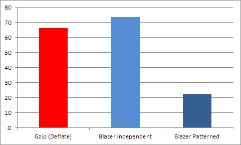

# Compression with preliminary pattern

Imagine, you have lot of similar data. This data can be log messages, soap integration xmls, status logs. And you want to save this data **independently** (if you don't need to do this, you can compress all messages into solid archive. It is best variant for compression, but as result all messages should be extracted if only one needed for view).
These messages can be stored in file system or database, but you want to store each message separately to keep fast access to it.

You want to compress this messages to save storage, but these messages are small and compress not very good as result.

But Blazer has a feature to compress these messages with pattern. As pattern you can choose any of these messages or prepare it manually to include more data. 

```
// creating patterned compressor
var p = BlazerPatternedHelper.CreateStream();
// one-time init of data
p.PreparePattern(patternedData);

// every time you want to compress data, use similar line
p.EncodeWithPattern(dataToCompress)

// same code for decompress
p.DecodeWithPattern(dataToDecompress)
```

## What is benefit in numbers?
This is complex question. If all messages are same, every new message will be compressed in 3-6 bytes and benefit will be fantastic.
If all messages are totally different, there are no benefits for this compression type.

Also, there are some philosophic question for pattern selection. It can be any message (e.g. first) or specially constructed template. This can increase compression rate for some per cents.

For example, we can choose messages with this format:

```
<?xml version="1.0"?>
<LogMessage xmlns:xsd="http://www.w3.org/2001/XMLSchema" xmlns:xsi="http://www.w3.org/2001/XMLSchema-instance">
  <EventDate>2016-07-04T01:09:51</EventDate>
  <Level>INFO</Level>
  <UserName>System</UserName>
  <ProcessingTime>25</ProcessingTime>
  <Message>xsxlnt e fg qamm</Message>
</LogMessage>
```

All fields can be changed, but in some limits (e.g. EventDate is always date, Level is INFO, DEBUG, ERROR or WARN). With these messages results are:


Or in table view:
Name                | Rate (lower is better)  
--------------------|-------------------------
GZip (only deflated block, without headers)       | 66.266%
Blazer Independent compression       | 82.157%
Blazer Patterned compression       | **22.616%**
Blazer Patterned compression with another template       | **20.506%**

So, patterned compression in this case is **3 times better** than GZip! (and really faster).

_(You can find code which generates messages and produces results in sources)_