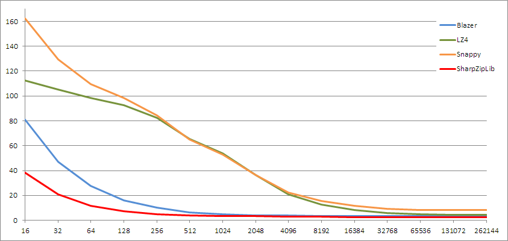
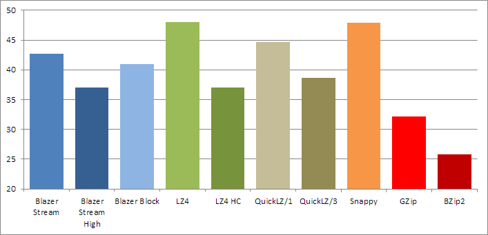

# Blazer
Blazer is high-performance archiver for .NET

Currently, it is on develop stage. It is relatively stable, but format and structure has not finished yet. So, you can use it for testing or for streaming transfer (without storing sensitive data).

## Description

Blazer is low-compression, fast-speed archiver/compressor **with stream supporting**.
In general, it similar to [LZ4](http://www.lz4.org/) or [Snappy](http://google.github.io/snappy/), but Blazer compression rate is slightly better and it supports streaming mode.

What is streaming mode? Imagine, you have a monitoring service, which sends a lot of *similar* data about own status. Usually this data is same, but slightly differs by time and some parameters. But every portion of data requires a *flush* operation. In another words, it should be saved on disk or transferred via network.
You want to compress this data, and want to do it fast, so, GZip is very slow for you. You can choose Snappy or LZ4, but these compressors are *block*. Every piece of data compressed independently. It is not problem with large chunks, but small chunks cause serious degradation.
This picture shows compression rate in relation to block size. Tests were performed on large log file, with .NET implementation of corresponding compressors. In .NET, standard [GZipStream](https://msdn.microsoft.com/en-us/library/system.io.compression.gzipstream(v=vs.110).aspx) does not support flush at all, so, instead of it [SharpZipLib](https://icsharpcode.github.io/SharpZipLib/) was used.

*Percent of compression more than 100% due adding of headers, footers and other structural elements by compressors*

You can see, that LZ4 and Snappy do very bad compression on small blocks, Blazer is better and GZip is best, but it is really slower other competitors. So, Blazer is good variant for fast data transferring and you can use it for every pipe streams (one side: writes and compress, other side: reads and decompress data).

### Compressors/Encoders
In real, Blazer can use **two** different algorithms with code names **stream** and **block** (There are another algorithm **no compression** it can be used for keeping blazer-structured stream).

**Stream** algorithm described above and it is very good for compression of streamed data. 
**Block** algorithm is used for compressing files. It uses large independent chunks, gives better compression rate and better compression speed. Also, can be realized in multi-threaded mode (currently, not implemented). But it has average decompression speed (same as compression) and will give bad results for small chunks.

Also, stream algorithm has **High** version (like LZ4 HC), which increases compression rate but compression speed is very low. This algorithm does not finished, it results even can be better in future implementations (but in fully compatible with standard structure, so, decompression is same).

In another words, you can meet next situations:

* **Compress-Decompress** (pipes) - use stream mode
* **Compress and forget** (e.g. dumps and backups - use block mode, and if you have a time, zip, 7z, bzip2 or similar archivers
* **Compress one time, decompress many times** (e.g. resources for application) - stream mode with high compression

### Compression rates

Compression rate of [Silesia corpus](http://sun.aei.polsl.pl/~sdeor/index.php?page=silesia) all tar'ed files.

*(Used .NET implementations of corresponding algorithms, most of them are wrappers for native code, [QuickLZ](http://www.quicklz.com/) does not use stream implementation in C#, so, data was simulated by code)*

Table version:

Name                | Rate      | Compression | Decompression 
--------------------|-----------|-------------|---------------------------
Blazer Stream       | 42.742%   | 189 MB/s    | 688 MB/s
Blazer Stream High  | 37.608%   | 20  MB/s    | 735 MB/s
Blazer Block        | 40.974%   | 222 MB/s    | 278 MB/s
LZ4                 | 48.028%   | 281 MB/s    | 986 MB/s
LZ4 HC              | 36.990%   | 28  MB/s    | 1182 MB/s
QuickLZ/1           | 44.691%   | 206 MB/s    | 227 MB/s
QuickLZ/3           | 38.605%   | 27  MB/s    | 306 MB/s
Snappy              | 47.847%   | 359 MB/s    | 409 MB/s
GZip                | 32.191%   | 22  MB/s    | 83 MB/s
BZip2               | 25.757%   | 4   MB/s    | 16 MB/s

## Other important points

Will be here later...

## License

[MIT](https://github.com/force-net/blazer/blob/develop/LICENSE) license
