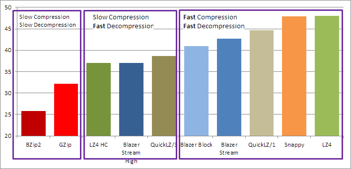

# Blazer
Blazer is high-performance archiver for .NET

Currently, it is on beta stage. It is relatively stable, file format is finished, but there are can be new features (should not break existing data). Also, there are small probability of 
breaking backward compatibility in case of serious issues (if they will be found).

## Description

Blazer is low-compression, fast-speed archiver/compressor **with stream supporting**.
In general, it similar to [LZ4](http://www.lz4.org/) or [Snappy](http://google.github.io/snappy/), but Blazer compression rate is slightly better and it supports streaming mode.

What is streaming mode? Imagine, you have a monitoring service, which sends a lot of *similar* data about own status. Usually this data is same, but slightly differs by time and some parameters. But every portion of data requires a *flush* operation. In another words, it should be saved on disk or transferred via network.
You want to compress this data, and want to do it fast, so, GZip is very slow for you. You can choose Snappy or LZ4, but these compressors are *block*. Every piece of data compressed independently. It is not problem with large chunks, but small chunks cause serious degradation.
This picture shows compression rate in relation to block size. Tests were performed on large log file, with .NET implementation of corresponding compressors. In .NET, standard [GZipStream](https://msdn.microsoft.com/en-us/library/system.io.compression.gzipstream(v=vs.110).aspx) does not support flush at all, so, instead of it [SharpZipLib](https://icsharpcode.github.io/SharpZipLib/) was used.


*Percent of compression more than 100% due adding of headers, footers and other structural elements by compressors*

You can see, that LZ4 and Snappy do very bad compression on small blocks, Blazer is better and GZip is best, but it is really slower other competitors. So, Blazer is good variant for fast data transferring and you can use it for every pipe streams (one side: writes and compress, other side: reads and decompress data).

### Compressors/Encoders
In real, Blazer can use **two** different algorithms with code names **stream** and **block** (There are another algorithm **no compression** it can be used for keeping blazer-structured stream).

**Stream** algorithm described above and it is very good for compression of streamed data. 
**Block** algorithm is used for compressing files. It uses large independent chunks, gives better compression rate and better compression speed. Also, can be realized in multi-threaded mode (currently, not implemented). But it has average decompression speed (same as compression) and will give bad results for small chunks.

Also, stream algorithm has **High** version (like LZ4 HC), which increases compression rate but compression speed is very low. This algorithm does not finished, it results even can be better in future implementations (but in fully compatible with standard structure, so, decompression is same).

In another words, you can meet next situations:

* **Compress-Decompress** (pipes) - use stream mode
* **Compress and forget** (e.g. dumps and backups - use block mode, and if you have a time, zip, 7z, bzip2 or similar archivers
* **Compress one time, decompress many times** (e.g. resources for application) - stream mode with high compression

### Compression rates

Compression rate of [Silesia corpus](http://sun.aei.polsl.pl/~sdeor/index.php?page=silesia) all tar'ed files.


*(Used .NET implementations of corresponding algorithms, most of them are wrappers for native code, [QuickLZ](http://www.quicklz.com/) does not use stream implementation in C#, so, data was simulated by code)*

Table version:

Name                | Rate (lower is better)  | Compression | Decompression 
--------------------|-------------------------|-------------|---------------------------
Blazer Stream       | 42.742%                 | 189 MB/s    | 688 MB/s
Blazer Stream High  | 37.608%                 | 20  MB/s    | 735 MB/s
Blazer Block        | 40.974%                 | 232 MB/s    | 314 MB/s
LZ4                 | 48.028%                 | 292 MB/s    | 1058 MB/s
LZ4 HC              | 36.990%                 | 28  MB/s    | 1182 MB/s
QuickLZ/1           | 44.691%                 | 206 MB/s    | 227 MB/s
QuickLZ/3           | 38.605%                 | 27  MB/s    | 306 MB/s
Snappy              | 47.847%                 | 359 MB/s    | 409 MB/s
GZip                | 32.191%                 | 22  MB/s    | 83 MB/s
BZip2               | 25.757%                 | 4   MB/s    | 16 MB/s


Same chart with another order and description:



This chart shows that bzip2 is best archiver, but it compression rate is **50** times slower than Blazer. GZip is **10** times slower. So, if you need acceptable compression rate but high speed:
Blazer is good choice for you. 

## Usage

There are two general variants of using this library. The first one, using a **Blazer.Net library** in your application. This library can be installed from nuget:

```
Install-Package Blazer.Net
```

Usage is simple: wrap your real stream with **BlazerInputStream** and write data to it:

```
using (var bs = new BlazerInputStream(File.Create("compressed.blz"), BlazerCompressionOptions.CreateStream()))
	File.OpenRead("uncompressed.txt").CopyTo(bs);
```

Decompression the same:

```
using (var bs = new BlazerOutputStream(File.OpenRead("compressed.blz")))
	bs.CopyTo(File.OpenWrite("decompressed.txt"));
```

Other variant is use Blazer.exe console archiver. 

```
:: Compress file test.txt to test.txt.blz
Blazer test.txt

:: Decompress test.txt.blz
Blazer -d test.txt

:: Show help
Blazer -h
```

### Far Integration

1. Install [MultiArc](http://plugring.farmanager.com/plugin.php?pid=915) Plugin
2. Go to Far\Plugins\MultiArc\Formats\custom.ini
3. Add next lines (Blazer should be in path, or add path to this options)

```
[Blazer]
TypeName=Blazer
ID=62 4C 7A 01
IDPos=
IDOnly=1
Extension=blz
List=Blazer -l %%AQ
Start="^-------"
End="^------"
Format0="yyyy tt dd hh mm ss aaaaa zzzzzzzzzzzz  nnnnnnnnnnnnnnnnnnnnnnnnnnnnnnnnnnnnnnnnnnnnnnnnnnnnnnnnnnnnnnnnnnnnnnnnnnnnnnnnnnnnnnnnnnnnnnnnnnnnnnnnnnnnnnnnnnnnnnnnnnnnnnnnnnnnnnnnnnnnnnnnnnnnnnnnnnnnnnnnnnnnnnnnnnnnnnnnnnnnnnnnnnnnnnnnnnnnnnnnnnnnnnnnnnnnnnnnnnnnnnnnnnnnnnnnnnnnnnnnnnnnnnnnnnnnnnnn"
Extract=Blazer -d {-p%%P} -f %%A @%%LQMN
ExtractWithoutPath=Blazer -d {-p%%P} -f %%AQ @%%LQMN
Test=Blazer -t {-p%%P} %%AQ @%%LQMN
Add=Blazer {-p%%P} %%AQ @%%LQMN
AllFilesMask="*"
```


## Features

Blazer compresses data into stream with special format and with variety of settings (default settings should be ok for you, but in advanced scenarios you can customize it):

* Header of stream contains all requied information for decompression (can be omitted if you know all information and pass it on decompression)
* Footer to check correctness of stream (if stream is not seekable, will be validated only on end of data)
* Crc32C checksum validation (on modern CPUs validation speed is about 20Gb per second)
* Ability to encrypt data
* Ability to encrypt data without revealing any information (header and footer are also encrypted)
* Ability to store information about compressing file (in future, several files can be compressed into one stream)
* Ability to add control information to stream between file blocks. Can be useful for passing some servicing information while compressing long stream of data without affecting it
* Ability to compress to stdout and read data from stdin (no seeks in stream, if it does not support it)
* Ability to use non-compressed data in same structure

## Implementation

Currently, Blazer is implementent in C# with full support of standard .NET Streams. Encoders and Decoders are implemented in C# and C both.
Native variant is faster than managed on ~50%. Library automatically selects native variant if available. If it impossible, safe managed variant is used.
Stream High algorithm currently on C# only.
Native implementation does not require additional setup like vcredist and embedded into library.

Console application (Blazer.exe) has embedded Blazer.Net.dll library and use it to compress or decompress files.


## Other important points

Will be here later...

## License

[MIT](https://github.com/force-net/blazer/blob/develop/LICENSE) license
